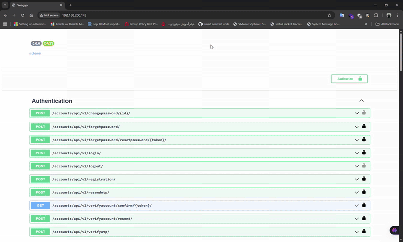

# 🌐 Social Network API

A modern **Social Network REST API** built with **Django REST Framework**, featuring JWT + OTP authentication, user profiles, posts, comments, follow requests, and async email notifications.  
The project is fully containerized using **Docker**, served via **Gunicorn + Nginx**, and uses **PostgreSQL**, **Redis**, and **RabbitMQ** for backend services.

---



---

## 🚀 Features

### 🔐 Authentication
- Register new users and verify via email
- Login with **OTP** and **JWT tokens**
- Password reset via email
- Account verification and resend verification email

### 👤 User Profiles
- View and edit user profiles
- Follow / unfollow other users
- Handle private profile follow requests (accept/reject/delete)
- View follower and following counts

### 📝 Posts & Interactions
- Create, update, and delete posts
- Like and comment on posts
- Manage posts with multiple statuses (Draft / Published / Deleted)

### 📬 Emails & Notifications
- Email templates for:
  - Account activation
  - Password reset
  - Follow request notifications  
- Asynchronous email sending via **Celery + RabbitMQ**

### ⚙️ System Architecture
- **Django REST Framework** for API logic  
- **PostgreSQL** as the main database  
- **Redis** for caching  
- **RabbitMQ** for async tasks and Celery broker 
- **Gunicorn + Nginx** for production serving  
- **Docker Compose** for multi-container orchestration  

---

##  Installation

### 1️⃣ Clone the repository
```bash
git clone https://github.com/hosseinpk/Social_Network.git
cd Social_Network
```

### 2️⃣ Create `.env` file
Create a `.env` file in the root directory with variables like:
```env
SECRET_KEY=your_secret_key
DEBUG=True
POSTGRES_DB=social_db
POSTGRES_USER=postgres
POSTGRES_PASSWORD=postgres
POSTGRES_HOST=db
POSTGRES_PORT=5432
```

### 3️⃣ Build and start containers
```bash
docker compose up --build
```

This will start:
- Django (Gunicorn)
- PostgreSQL
- Redis
- RabbitMQ
- Nginx (static/media serving)
- Smtp4dev (email server)

---

## 🧠 API Documentation

Swagger UI is automatically available at:
```
http://localhost
```

---

## 🗂️ Project Structure
```
Social_Network/
│
├── core/                  # Django application source
│   ├── accounts/          # Authentication, registration, OTP
│   ├── profiles/          # User profiles & follow system
│   ├── posts/             # Posts, comments, likes
│   ├── tasks/             # Celery tasks for email, notifications
│   └── core/settings.py   # Main project settings
│
├── nginx/                 # Nginx configuration
├── docker-compose.yml
├── Dockerfile
├── requirements.txt
└── README.md
```

---

##  Development Commands
Run Django management commands inside the container:
```bash
docker compose exec django python manage.py makemigrations
docker compose exec django python manage.py migrate
docker compose exec django python manage.py createsuperuser
docker compose exec django python manage.py collectstatic --noinput
```

---

##  Tech Stack

| Component | Technology |
|------------|-------------|
| Framework | Django REST Framework |
| Auth | JWT + OTP |
| Database | PostgreSQL |
| Cache | Redis |
| Task Queue | Celery + RabbitMQ |
| Server | Gunicorn + Nginx |
| Containerization | Docker Compose |
| Documentation | drf-spectacular (Swagger UI) |

---

##  Demo

Here’s a preview of the live API documentation:


---

## 📄 License
This project is licensed under the **MIT License** — feel free to use and modify it.

---

##  Author
**[HosseinPK](https://github.com/hosseinpk)**  

